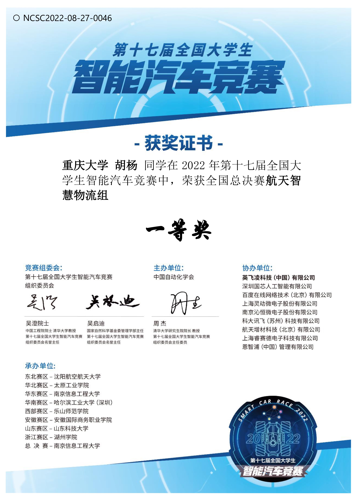
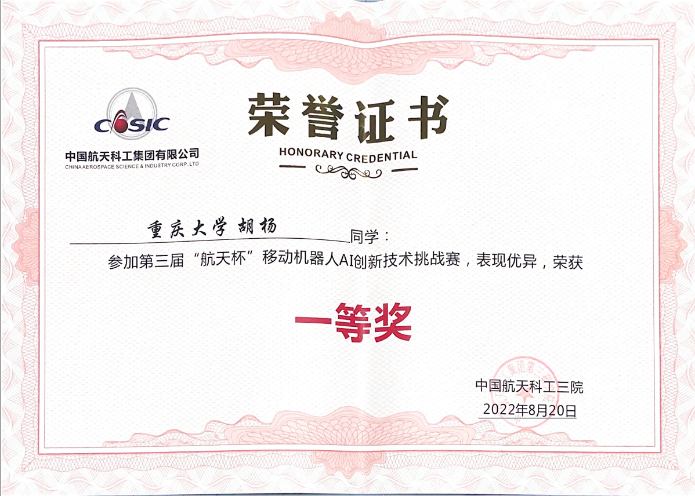
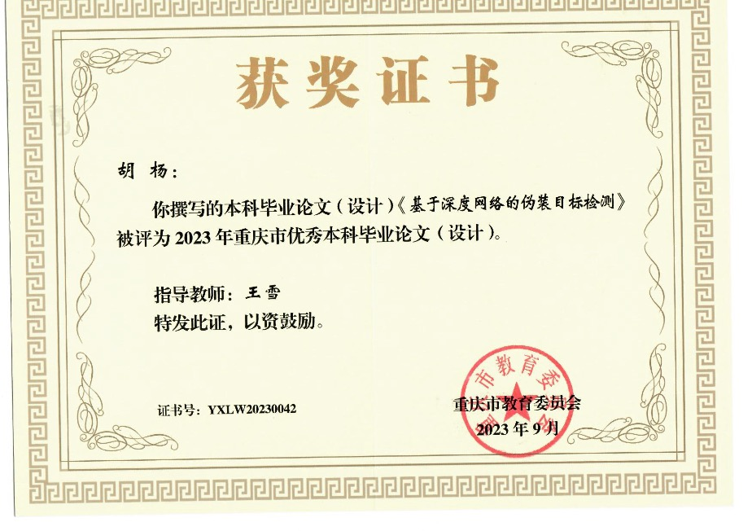
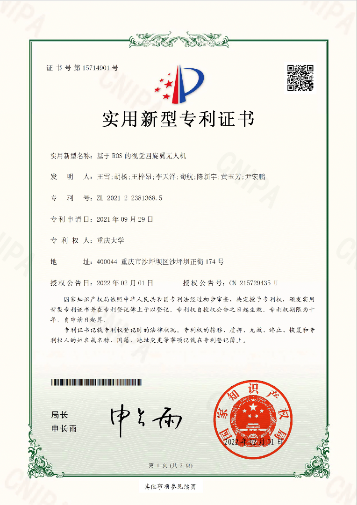

# Certificates

## 1. National First Prize - Smart Logistics Group
**Event:** 17th National Undergraduate Intelligent Vehicle Competition  
**Award:** First Prize  
**Issued by:** China Automation Society  
**Date:** 2022

This certificate was awarded for my participation in the national finals of the Aerospace Smart Logistics Group, where our team achieved First Prize in the 17th National Undergraduate Intelligent Vehicle Competition.

---

## 3. National First Prize - "Aerospace Cup" AI Innovation Challenge
**Event:** 3rd "Aerospace Cup" Mobile Robot AI Innovation Technology Challenge  
**Award:** First Prize  
**Issued by:** China Aerospace Science & Industry Corp., Ltd  
**Date:** August 20, 2022  

This certificate was awarded for outstanding performance in the 3rd "Aerospace Cup" Mobile Robot AI Innovation Technology Challenge.

---

## 4. Chongqing Outstanding Undergraduate Thesis Award
**Thesis Title:** Camouflage Target Detection Based on Deep Learning Networks  
**Award:** Chongqing Outstanding Undergraduate Thesis  
**Issued by:** Chongqing Municipal Education Commission  
**Date:** September 2023  
**Advisor:** Wang Xue

This certificate was awarded for the excellence of my undergraduate thesis on "Camouflage Target Detection Based on Deep Learning Networks," recognized as one of the outstanding theses in Chongqing in 2023.

---

## 2. Utility Model Patent Certificate
**Patent Name:** Vision-Based Quadrotor UAV Using ROS  
**Patent Number:** ZL 2021 2 2381368.5  
**Issue Date:** February 1, 2022  
**Applicant:** Chongqing University  

This utility model patent was granted for the design and implementation of a vision-based quadrotor UAV system using ROS, enhancing control precision and obstacle avoidance capabilities.